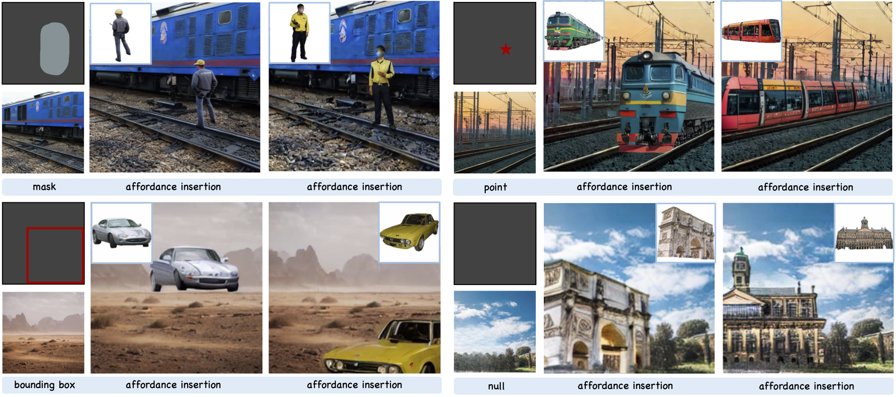

# Affordance-Aware Object Insertion via Mask-Aware Dual Diffusion

[](https://github.com/KaKituken/affordance-aware-any/blob/main/LICENSE) [](https://kakituken.github.io/affordance-any.github.io/) 

[**Installation**](#-installation) | [**Dataset**](#-dataset) | [**Checkpoint**](#-checkpoint) |[**Demo**](#-demo) | [**Training & Evaluation**](#-training & evaluation)

This repository maintains the official implementation of the paper **Affordance-Aware Object Insertion via Mask-Aware Dual Diffusion** by [Jixuan He](https://kakituken.github.io/home), [Wanhua Li](https://li-wanhua.github.io/),  [Ye Liu](https://yeliu.dev/), [Junsik Kim](https://sites.google.com/site/jskimcv/), [Donglai Wei](https://donglaiw.github.io/) and [Hanspeter Pfister](https://vcg.seas.harvard.edu/people/).




[[Project Page]](https://kakituken.github.io/affordance-any.github.io/)

## 🔨 Installation

Run the following instruction to set up the environment.

```sh
cd model
conda env create -f environment.yaml
```


## 🏷️ Dataset

### SAM-FB Dataset

We build the SAM-FB dataset on top of original [SA-1B](https://ai.meta.com/datasets/segment-anything/) dataset.

Due to the storage limitation, you can download the first 10 sub-folder of SAM-FB dataset [here](). 

To build the rest of the dataset, please download the [SA-1B](https://ai.meta.com/datasets/segment-anything/) dataset and follow the instructions in the next section.

### Build Your Own Dataset

Our automatic pipeline allows user to build their own dataset by providing only the images. You can either download the original [SA-1B](https://ai.meta.com/datasets/segment-anything/) dataset or provide a set of images under `./data` folder.

#### 1. Download SAM
First, download the SAM checkpoint from [here](https://github.com/facebookresearch/segment-anything#model-checkpoints) and put it int the `./ckpt` folder.

#### 2. Get the masks
Saying you have a folder from SA-1B, `./data/sa_000010/`

Please run the following instruction to get the mask after NMS
```sh
cd dataset-builder/img_data

python mask_nms.py \
	--image-dir ./data/sa_000010/ \
	--save-dir ./data/sa_000010/ \
	--model-path ./ckpt/sam_vit_h_4b8939.pth
```

#### 3. Inpainting
After getting the masks, run following to inpaint the background and construct pair data. The filter will also perform here.

Download the checkpoint [here]() for foreground filtering.

```sh
python inpainting_sa1b.py \
	--annotation-path ./data/sa_000010/ \
	--image-path ./data/sa_000010/ \
	--save-path ./SAM-FB/ \
	--model-path ./ckpt/quality_ctrl.pth
```

### Video Dataset (Youtube-VOS)
We also support video dataset. For [YTB-VOS]()-like dataset, simply run

```sh
cd dataset-builder/video_data

python vdata_process.py \
	-a ./data/Youtube-VOS/train/Annotations \
	-i ./data/Youtube-VOS/train/JPEGImages \
	-s ./SAM-FB-video
```


## 📌 Checkpoint

We provide two checkpoints for both 256x256 and 512x512 resolution. Download them here

- 256 x 256: [Hugging Face](https://huggingface.co/Kakituken/affordance-insertion-any/resolve/main/affordance_256.ckpt?download=true)
- 512 x 512: [Hugging Face](https://huggingface.co/Kakituken/affordance-insertion-any/tree/main/affordance_512.ckpt)

Put them at `./ckpt/affordance_256.ckpt` or  `./ckpt/affordance_512.ckpt`.


## 💻 Demo

You can run the demo on your local machine using `gradio` by running

```sh
cd model/script
python infer_gui.py
```

You can also do inference on single image by 

```sh
python inference_dual.py \
    -b path/to/background.png \
    -f path/to/foreground.png \
    -m path/to/mask.png \
    -s path/to/save \
    -c ../config/affordance_512.yaml \
    -k ../../ckpt/affordance_512.ckpt \
    --num-predict 4 \
    --num-repeats 4
```


## 🚀 Training & Evaluation

If you hope to train the model by yourself, please follow the instructions.

### 1. Download SD-inpainting checkpoint

Instead of training from the scratch, we load the `sd1.5-inpainting` checkpoint as initailization. You can download the checkpoint [here](https://huggingface.co/runwayml/stable-diffusion-inpainting/resolve/main/sd-v1-5-inpainting.ckpt), and put it into the `ckpt` folder.

### 2. Modify the config

If you want to train on 512 x 512 resolution, please modify the `./config/affordance_512.yaml`. Change all the item with `TODO` to fit your own dataset/checkpoint path.

### 3. Training & Eval

Then, run 

```sh
export CUDA_VISIBLE_DEVICES=0,1,
python main.py \
    --base config/affordance_512.yaml \
    -t \
    --gpus 2 \
    --name affordance_512 \
    --logdir ./logs/affordance_512
```

to train the model. You can then view the evaluation curve using `tensorboard` by

```sh
tensorboard --logdir=./logs/affordance_512
```
